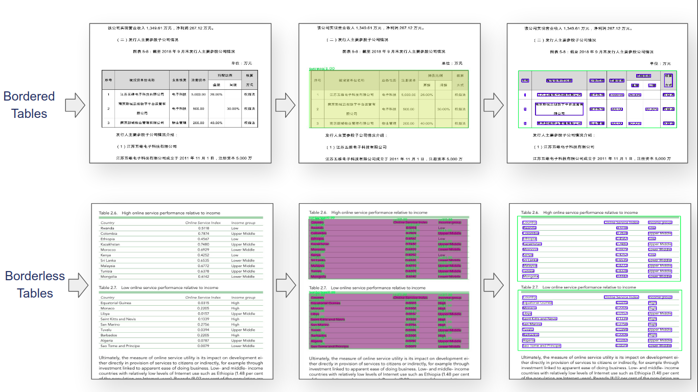
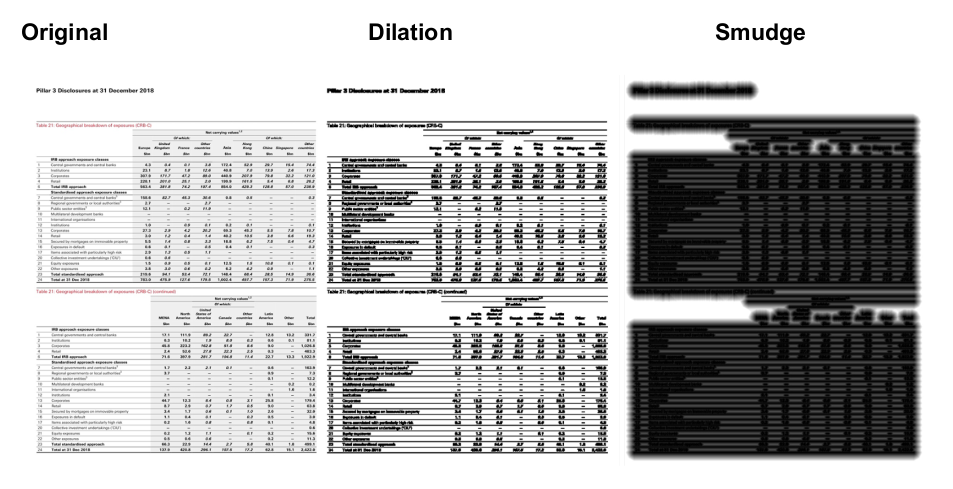
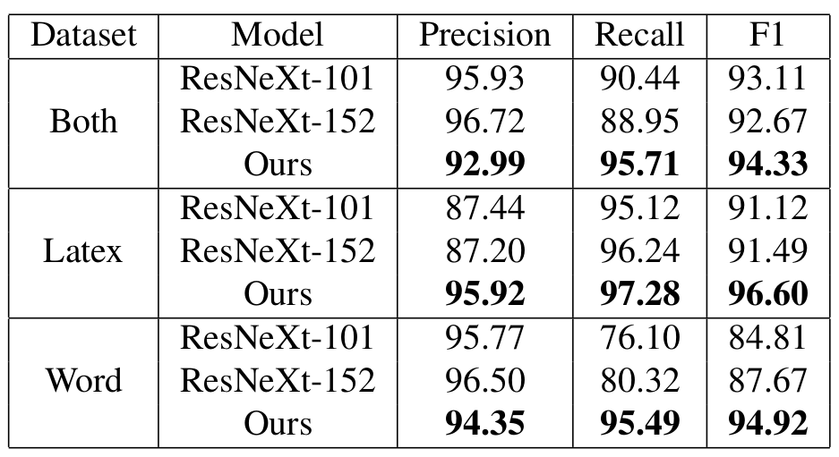
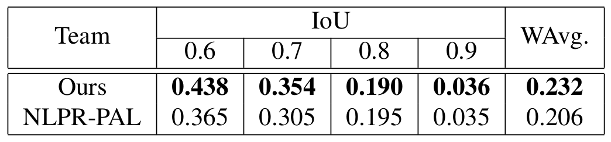

# CascadeTabNet
[](https://paperswithcode.com/sota/table-detection-on-icdar2013-1?p=cascadetabnet-an-approach-for-end-to-end)
> **CascadeTabNet: An approach for end to end table detection and structure recognition from image-based documents**<br>
> [Devashish Prasad](https://github.com/DevashishPrasad),
> [Ayan Gadpal](https://github.com/ayangadpal),
> [Kshitij Kapadni](https://github.com/kshitijkapadni),
> [Manish Visave](https://github.com/ManishDV),
> <br>
> [Preprint Link of Paper](https://arxiv.org/abs/2004.12629)<br>
> The paper has been accepted at [CVPR 2020 Workshop on Text and Documents in the Deep Learning Era](https://cvpr2020text.wordpress.com/)<br>
> 

## End to End Table Recognition Dataset 
We manually annotated some of the <a href="http://sac.founderit.com/">ICDAR 19 table competition (cTDaR)</a> dataset images. Details about the dataset are mentioned in the paper. 
<a href="https://drive.google.com/drive/folders/1mNDbbhu-Ubz87oRDjdtLA4BwQwwNOO-G?usp=sharing">dataset link</a>

## 1. Introduction
CascadTabNet is an automatic table recognition method for interpretation of tabular data in document images. We present an improved deep learning-based end to end approach for solving both problems of table detection and structure recognition using a single Convolution Neural Network (CNN) model. CascadeTabNet is a Cascade mask Region-based CNN High-Resolution Network (Cascade mask R-CNN HRNet) based model that detects the regions of tables and recognizes the structural body cells from the detected tables at the same time. We evaluate our results on ICDAR 2013, ICDAR 2019 and TableBank public datasets. We achieved 3rd rank in ICDAR 2019 post-competition results for table detection while attaining the best accuracy results for the ICDAR 2013 and TableBank dataset. We also attain the highest accuracy results on the ICDAR 2019 table structure recognition dataset. 



## 2. Setup
<b>Models are developed in Pytorch based <a href="https://github.com/open-mmlab/mmdetection">MMdetection</a> framework (Version 1.2)</b>
<br>

<pre>
pip install -q mmcv terminaltables
git clone --branch v1.2.0 'https://github.com/open-mmlab/mmdetection.git'
cd "mmdetection"
python setup.py install
python setup.py develop
pip install -r {"requirements.txt"}
</pre>

<b>Code is developed under following library dependencies</b> <br>

PyTorch = 1.4.0<br>
Torchvision = 0.5.0<br>
Cuda = 10.0<br>

<pre>
pip install torch==1.4.0+cu100 torchvision==0.5.0+cu100 -f https://download.pytorch.org/whl/torch_stable.html
</pre>

**If you are using Google Colaboratory (Colab), Then you need add**
```
from google.colab.patches import cv2_imshow
```
and replace all the `cv2.imshow` with `cv2_imshow`

## 3. Model Architecture

<a href="imgs/theonnx.onnx.svg">Model Computation Graph</a>

## 4. Image Augmentation
<br>
Codes: <a href="https://github.com/DevashishPrasad/CascadeTabNet/blob/master/Data%20Preparation/Dilation.py">Code for dilation transform</a> <a href="https://github.com/DevashishPrasad/CascadeTabNet/blob/master/Data%20Preparation/Smudge.py">Code for smudge transform</a>

## 5. Benchmarking
### 5.1. Table Detection
#### 1. ICDAR 13


#### 2. ICDAR 19 (Track A Modern)


#### 3. TableBank

<br>
<b>TableBank Benchmarking</b> : <a href="https://doc-analysis.github.io/">Leaderboard</a><br>
TableBank Dataset Divisions : <a href="https://drive.google.com/open?id=1lxpK4sa4LTSHPFuQEsjFdx87NAlQ8F5O">TableBank</a>

### 5.2. Table Structure Recognition
#### 1. ICDAR 19 (Track B2)


## 6. Model Zoo
Config file for the Models :

<a href="Config/cascade_mask_rcnn_hrnetv2p_w32_20e.py/">cascade_mask_rcnn_hrnetv2p_w32_20e.py</a><br>
Note: Config paths are only required to change during training

Checkpoints of the Models we have trained : 

<table>
  <tr>
  <th>Model Name</th><th>Checkpoint File</th>
  </tr>
  <tr>
  <td>General Model table detection</td><td><a href="https://drive.google.com/open?id=1-xfq5hDmFdKgbY9FSFTmhSlcb2p13RPn">Checkpoint</a></td>
  </tr>
  <tr>
  <td>ICDAR 13 table detection</td><td><a href="https://drive.google.com/open?id=1-mVr4UBicFk3mjUz5tsVPjQ4jzRtiT7V">Checkpoint</a></td>
  </tr>
  <tr>
  <td>ICDAR 19 (Track A Modern) table detection</td><td><a href="https://drive.google.com/open?id=1vfUr4pmmI4GICZubAnBeFU8pviMUW_c9">Checkpoint</a></td>
  </tr>  
  <tr>
  <td>Table Bank Word table detection</td><td><a href="https://drive.google.com/open?id=1-ZnV84t61IrkAfQH7dOATpo_T4C1J4Qa">Checkpoint</a></td>
  </tr>    
  <tr>
  <td>Table Bank Latex table detection</td><td><a href="https://drive.google.com/open?id=1-9EzU_LfD6fE8iJFjOZ3nBsCObqhpNUa">Checkpoint</a></td>
  </tr>    
  <tr>
  <td>Table Bank Both table detection</td><td><a href="https://drive.google.com/open?id=1-vjfGRhF8kqvKwZPPFNwiTaOoonJlGgv">Checkpoint</a></td>
  </tr>      
  <tr>
  <td>ICDAR 19 (Track B2 Modern) table structure recognition</td><td><a href="https://drive.google.com/open?id=1-QieHkR1Q7CXuBu4fp3rYrvDG9j26eFT">Checkpoint</a></td>
  </tr>      
</table>

## 7. Additional Resources
You may refer this <a href="https://www.dlology.com/blog/how-to-train-an-object-detection-model-with-mmdetection/">tutorial</a> for training Mmdetection models on your custom datasets in colab.<br>
<a href="results.pdf">Supplementary file</a> having useful links and results

## Contact
Devashish Prasad : devashishkprasad [at] gmail [dot] com <br>
Ayan Gadpal : ayangadpal2 [at] gmail [dot] com <br>
Kshitij Kapadni : kshitij.kapadni [at] gmail [dot] com <br>
Manish Visave : manishvisave149 [at] gmail [dot] com <br>

## License
The code of CascadeTabNet is released under the MIT License. There is no limitation for both academic and commercial usage.

## Cite as
If you find this work useful for your research, please cite our paper:
```
@misc{ cascadetabnet2020,
    title={CascadeTabNet: An approach for end to end table detection and structure recognition from image-based documents},
    author={Devashish Prasad and Ayan Gadpal and Kshitij Kapadni and Manish Visave and Kavita Sultanpure},
    year={2020},
    eprint={2004.12629},
    archivePrefix={arXiv},
    primaryClass={cs.CV}
}
```
