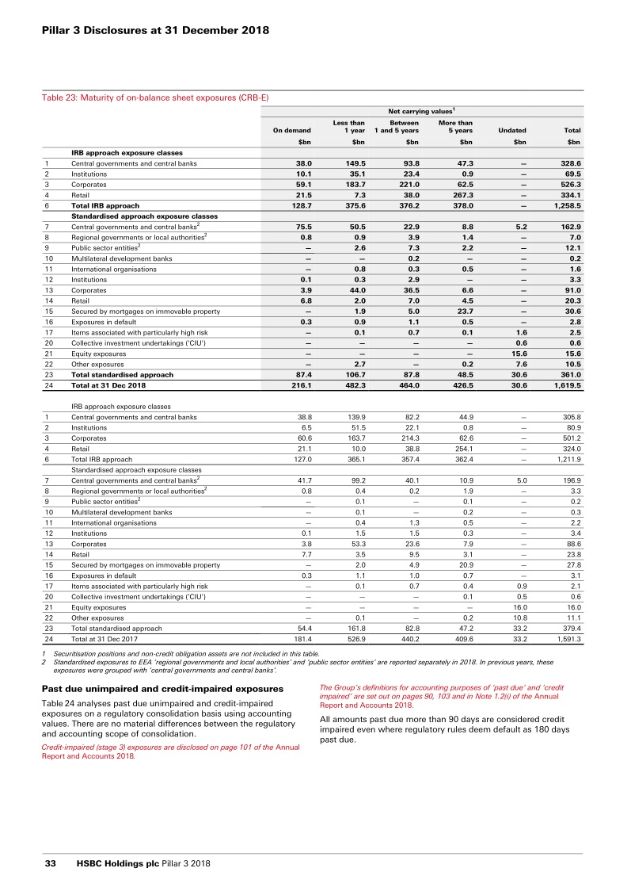
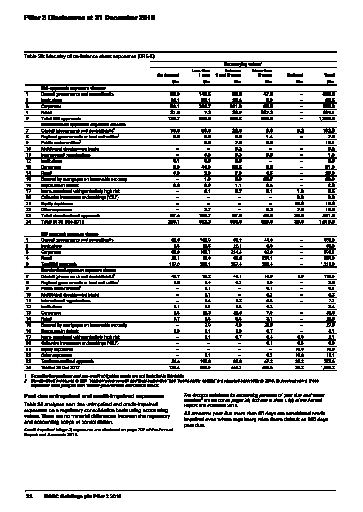
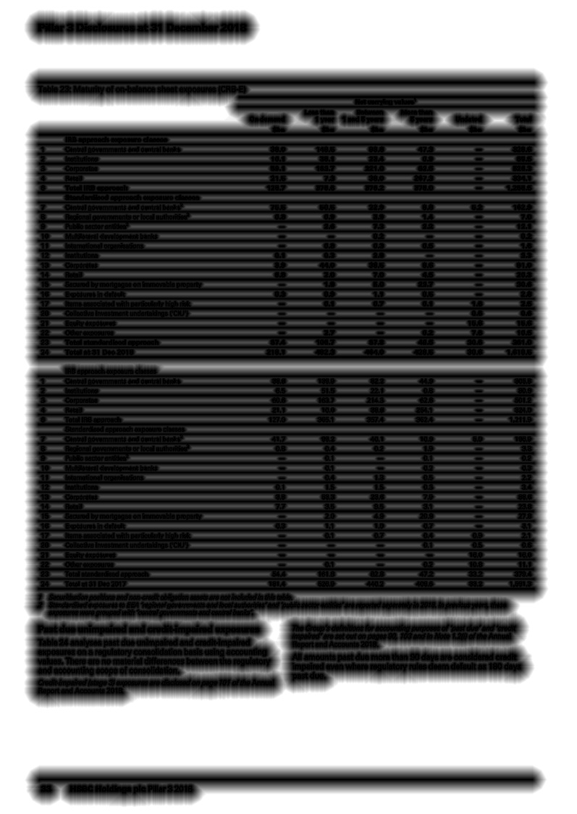

# CascadeTabNet

## License
The code of CascadeTabNet is released under the MIT License. There is no limitation for both acadmic and commercial usage.

## Paper
Link of Paper : The paper has been accepted at <b>CVPR2020 Workshop on Text and Documents in the Deep Learning Era</b> and preprint link will be available soon

## End to End Dataset 
We manually annotated some of the <a href="http://sac.founderit.com/">ICDAR 19 table competition (cTDaR)</a> dataset images for table cell detection in borderless tables while also categorizing tables into two classes (bordered and borderless) and will be releasing the annotations to the community. 
<a href="https://drive.google.com/drive/folders/1mNDbbhu-Ubz87oRDjdtLA4BwQwwNOO-G?usp=sharing">dataset link</a>

## Introduction
CascadTabNet is an automatic table recognition method for interpretation of tabular data in document images. We present an improved deep learning-based end to end approach for solving both problems of table detection and structure recognition using a single Convolution Neural Network (CNN) model. CascadeTabNet is a Cascade mask Region-based CNN High-Resolution Network (Cascade mask R-CNN HRNet) based model that detects the regions of tables and recognizes the structural body cells from the detected tables at the same time. We evaluate our results on ICDAR 2013, ICDAR 2019 and TableBank public datasets. We achieved 3rd rank in ICDAR 2019 post-competition results for table detection while attaining the best accuracy results for the ICDAR 2013 and TableBank dataset. We also attain the highest accuracy results on the ICDAR 2019 table structure recognition dataset.

## Model Architecture

<a href="imgs/theonnx.onnx.svg">Model Computation Graph</a>

## Image Augmentation
### Original Image

### Dilation Transform
<a href="">Code for dilation transform</a>

### Smudge Transform
<a href="">Code for smudge transform</a>

## Benchmarking
### Table Detection
#### ICDAR 13

#### ICDAR 19

#### TableBank

### Table Structure Recognition

Whole code will be released soon in this repository

<!--## Citing
<pre>
@article{
  cascacadetabnet2020
  authors = ""
  title = ""
  journal = ""
  year = ""
}
</pre>-->
